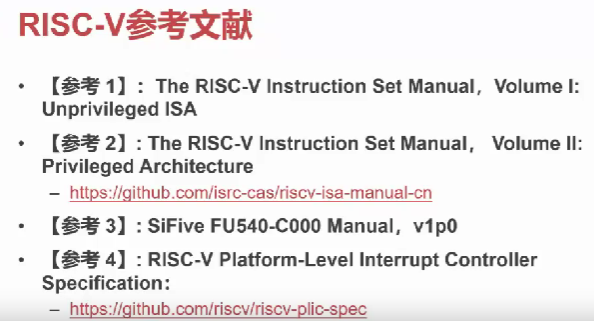

# 附录 A - 可供参考的各种资料汇总

## 本节目录

- [附录 A - 可供参考的各种资料汇总](#附录-a---可供参考的各种资料汇总)
  - [本节目录](#本节目录)
  - [Risc-V 参考文献](#risc-v-参考文献)
  - [Linux 内核文档](#linux-内核文档)

## Risc-V 参考文献

- 参考二：[https://github.com/isrc-cas/riscv-isa-manual-cn](https://github.com/isrc-cas/riscv-isa-manual-cn)
- 参考四：[https://github.com/riscv/riscv-plic-spec](https://github.com/riscv/riscv-plic-spec)

## Linux 内核文档

[https://www.kernel.org/doc/html/v6.9-rc7/index.html](https://www.kernel.org/doc/html/v6.9-rc7/index.html)
