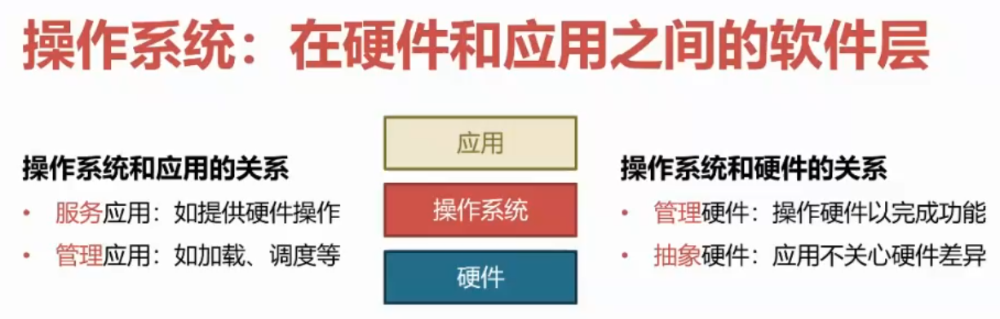

# 什么是操作系统

## 本节目录

- [什么是操作系统](#什么是操作系统)
  - [本节目录](#本节目录)
  - [硬件和应用之间的软件层](#硬件和应用之间的软件层)
  - [为应用提供的部分服务](#为应用提供的部分服务)
  - [应用的部分管理功能](#应用的部分管理功能)

## 硬件和应用之间的软件层

操作系统是硬件和应用之间的软件层。  
一方面它提供了硬件操作接口和系统调用，来帮助应用程序来访问和利用硬件资源，还负责应用程序的加载和调度，来确保硬件资源的有效利用；  
另一方面它还控制硬件设备来完成各种功能，并且对硬件进行抽象，使得应用程序的开发者，不再需要关注于硬件的差异。

对于操作系统的位置和作用，可以参考下图：

通过上面的图，我们可以看到，操作系统与硬件之间的关系比较好理解，所以，我们接下来将会详细看看，操作系统到底为了应用提供了哪些服务和管理。

## 为应用提供的部分服务

在实际应用中，操作系统主要为应用提供了下面列出的一系列服务。但由于想要举出例子，必须涉及到操作系统的一些特殊名词，在编撰本文档时，默认同学们已经通过导学阶段，对于操作系统的一下名词有了初步的认识，所以建议同学们在遇到看不懂的地方时，可以复习一下涉及到的名词。

以下是操作系统为应用程序提供的具体服务内容：

- **计算资源的抽象**
  - CPU：通过**进程**或**线程**的调度，应用程序不再直接受限于物理 CPU 的数量。
  - 内存：提供**虚拟内存**机制，使得应用程序的内存大小、连续性和隔离性不再受物理内存的限制。
  - I/O 设备：将各种 I/O 设备统一抽象为**文件**接口，为应用程序提供统一的访问方式。
- **线程间的同步**
  - 应用程序可以实现自己的同步原语（如**lock**），但操作系统通常提供更高效、更底层的同步机制。
  - 操作系统提供的同步原语（如**futex**）与线程切换紧密结合，以优化性能。
- **进程间的通信**
  - 应用程序可以利用网络进行进程间通信（如通过**loopback 设备**）。
  - 操作系统提供了更高效的本地通信机制（如**pipe**），这些机制通常具有更丰富的语义和更优化的性能。

其它服务不再举例，有兴趣的同学可以自行了解。

## 应用的部分管理功能

现代应用程序普遍支持高并发，而这种对高并发的处理能力在很大程度上依赖于操作系统的支持。以下是操作系统为应用程序提供的一些关键管理功能：

- 应用生命周期管理

  - **加载**：操作系统负责将应用程序加载到内存中，并准备其执行环境。
  - **迁移**：在某些情况下，操作系统可以将正在运行的应用程序从一个物理或虚拟环境迁移到另一个环境，以保持服务的连续性和负载均衡。
  - **销毁**：当应用程序不再需要或发生错误时，操作系统负责清理其占用的资源并终止其执行。

- 计算资源分配

  - **CPU**：操作系统通过调度机制，根据优先级、时间片轮转或其他策略来分配 CPU 资源给不同的应用程序。
  - **内存**：操作系统管理内存分配，确保每个应用程序有足够的内存空间来执行其任务，同时避免内存泄漏和溢出。
  - **I/O 设备**：操作系统提供设备的复用和分配机制，确保多个应用程序可以安全、高效地访问共享的 I/O 设备。

- 安全与隔离

  - **应用程序内部**：操作系统提供访问控制机制，确保应用程序只能访问其被授权的资源，防止内部的安全漏洞和错误。
  - **应用程序之间**：
    - **错误隔离**：操作系统通过进程、线程或容器等技术实现应用程序之间的错误隔离，确保一个应用程序的错误不会影响其他应用程序的正常运行。
    - **性能隔离**：操作系统通过资源配额、优先级调度等技术实现应用程序之间的性能隔离，确保每个应用程序都能获得其所需的计算资源，避免资源竞争导致的性能下降。

通过上述管理功能，操作系统为应用程序提供了一个稳定、高效、安全的运行环境，使其能够支持高并发并应对各种复杂的业务场景。
