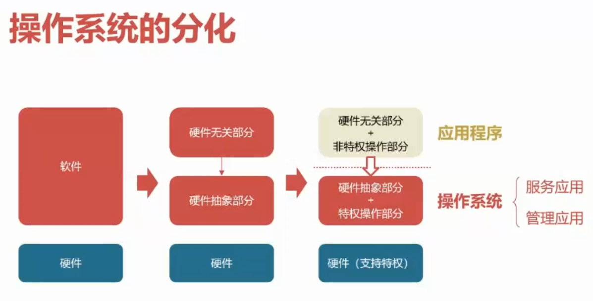
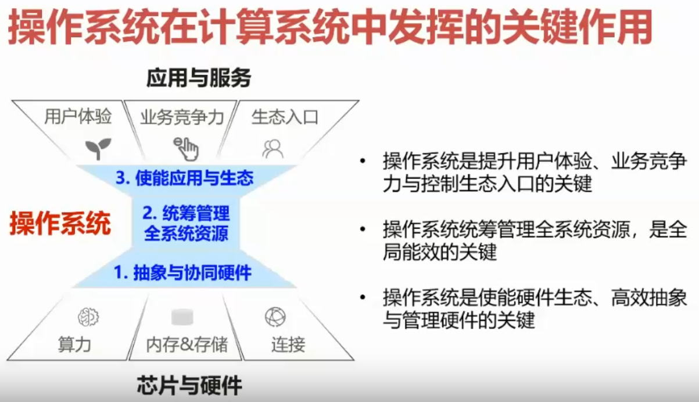
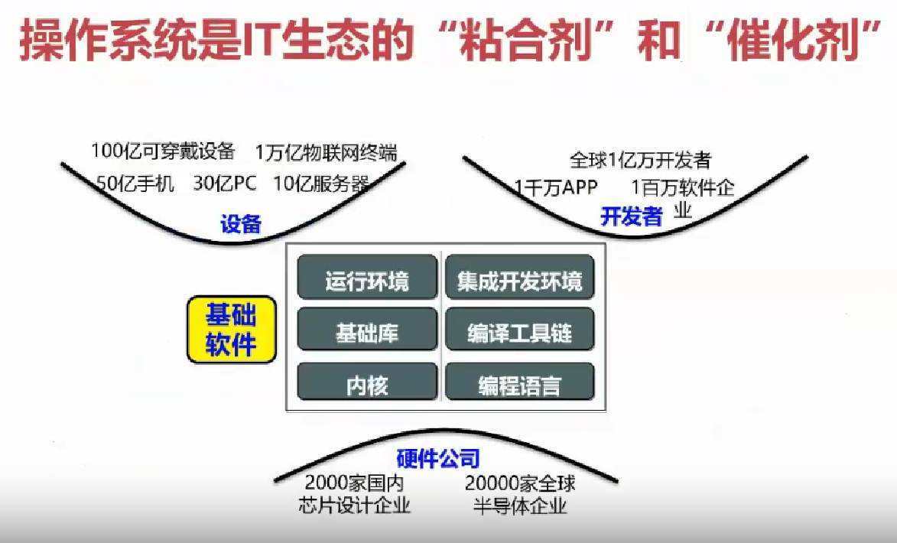

# 为什么要有操作系统

## 本节目录

- [为什么要有操作系统](#为什么要有操作系统)
  - [本节目录](#本节目录)
  - [应用与操作系统的解耦](#应用与操作系统的解耦)
  - [特权级的引入](#特权级的引入)
  - [操作系统的分化](#操作系统的分化)
  - [对硬件（CPU）的要求](#对硬件cpu的要求)
  - [操作系统的两种演化](#操作系统的两种演化)
  - [目前操作系统的关键作用](#目前操作系统的关键作用)

## 应用与操作系统的解耦

在最早的时候，是完全没有“操作系统”这个概念的。这时的应用程序，将所有的功能都汇聚到了一起，开发人员身兼数职，从磁盘读写到程序逻辑，一切都需亲手操持。

然而，随着技术的进步和需求的增长，应用程序的功能日益丰富，代码量也如滚雪球般不断膨胀。开发人员发现，维护这样一个庞大的、功能混杂的程序变得越来越困难。为了解决这个问题，人们开始尝试将应用程序的底层存储和逻辑工作分开，将它们各自封装成独立的模块。

这种“分化”带来了革命性的变化。开发人员可以将一些常用的底层存储和逻辑工作（如磁盘读写、内存管理等）封装成特定的模块，这些模块通过统一的接口与其他模块进行交互。这样，开发人员就可以更加专注于应用程序的核心逻辑，而无需过多关注底层细节。而这些被封装好的模块，提供了非常丰富的功能，使得我们在开发时，只需要调用这些库的接口，就能获得所需的功能，而无需从头开始编写代码。

看到这里，你是不是想到了什么？没错，这时的这些模块，其实就类似我们现在常用的“库”，只需要调用其接口，就能得到想要的结果。但是，问题来了，既然这些“库”就已经能够较优的构成应用程序了，那么为什么还需要操作系统呢？

## 特权级的引入

想要回答上面的问题，我们必须了解一段计算机的发展史。最早的计算机，使用纸带进行参数配置、代码录入等工作，这极为不便。后续，人们为了解决计算机计算速度远高于人类录入速度的矛盾，开发了批处理系统。但批处理系统一时间只能处理一个任务，无法同时处理多个任务，导致一旦某任务过程中，发出了 I/O 请求，CPU 就必须等待该请求完成，这段时间就导致了 CPU 资源的浪费。因此，人们再次升级计算机，开发了多道程序系统。

多道程序系统，通过时分复用计算资源的方式，在一台计算机上同时运行多个应用程序。但同时运行，就带来了一个新的问题：如何保证不同应用间的隔离？假设有两个程序，它们都能随意使用硬件设备，第一个应用希望关机，第二个应用则希望格式化硬盘，那么最终的结果就很可能是，两个应用彼此干扰，硬盘只格式化了一半。

为了解决上面的问题，人们只好引入了“特权级”的概念，至少具有两个特权级，即，位于低权限时，不能对计算机的全局状态进行任何改变；而高权限时，则集中运行能够操控整个计算机的代码。我们称这部分代码所执行后，能改变全局状态的操作，为**特权操作**，在高权限状态，慢慢分化出了**操作系统**（的内核）。

有兴趣了解更多操作系统历史的同学们，可以通过[此链接](https://www.cnblogs.com/Dominic-Ji/articles/10929381.html)，查看更多内容。

## 操作系统的分化

操作系统的分化阶段，大致如下图所示：

## 对硬件（CPU）的要求

在引入权限级后，对硬件也提出了更多的要求。

对于 CPU 来说，具体的改变如下所示：

- 将 CPU 对软件提供的接口称为 ISA
  - ISA: Instruction Set Architecture，中文译作**指令集架构**。
  - ISA 内，包含软件可见、可操作的接口，这些接口内包含各种指令和寄存器等。
- CPU 也相应分化出两个模式：非特权模式和特权模式
  - 非特权模式 ISA：应用可使用的指令和寄存器
  - 特权模式 ISA：只有操作系统才可使用的指令和寄存器

通常，我们将特权模式称为**内核态**，将非特权模式称为**用户态**。将从用户态切换到内核态的指令，称为**特权指令**。这一过程中，执行的操作称为**trap**（陷入）。

在后续，我们会涉及到 trap 指令的源码，推荐各位同学提前自行了解。

## 操作系统的两种演化

- 外部 -> 接口的演化：更好地应对新场景
  - POSIX 接口：定义了一组系统调用的接口，用来为应用提供兼容性
  - Linux：系统调用不断有新的加入、旧的退出
  - 鸿蒙：分布式软总线等
- 内部 -> 架构的演化：
  - 更好地应对复杂性：宏内核架构、微内核架构、外核架构、多内核架构等
  - 为了更好的扩展性、容错性、安全性、兼容性、灵活性、性能等

对于上面的演化内容，大家可以依照自己兴趣和时间安排，进行了解。

## 目前操作系统的关键作用

以下部分，引用了老师的 PPT：

