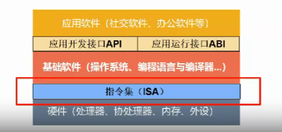
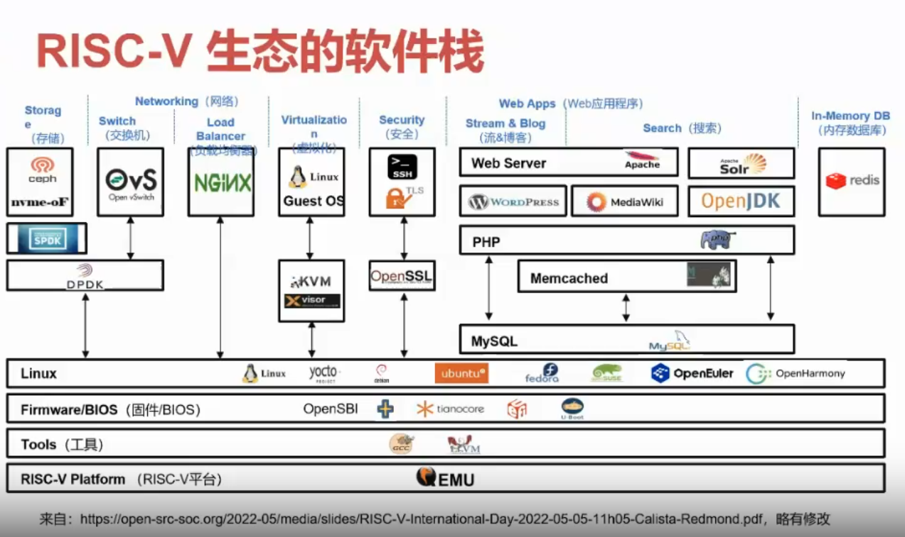
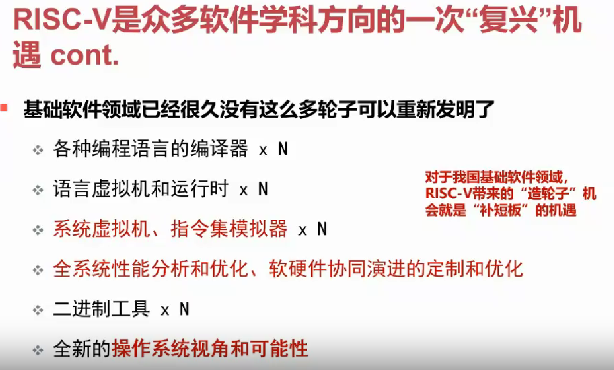

# RISC-V：操作系统的未来发展方向

## 本节目录

- [RISC-V：操作系统的未来发展方向](#risc-v操作系统的未来发展方向)
  - [本节目录](#本节目录)
  - [什么是“指令集”](#什么是指令集)
  - [Risc-V 的重要价值](#risc-v-的重要价值)

## 什么是“指令集”

指令集架构(Instruction Set Architecture，ISA)，简称指令集，是计算机系统中硬件与软件之间分界线和交互规范标准，，也是软硬件生态的起始原点。其位于计算机内的地位如下图所示：

对于当前的指令集领域，尚未形成一套国际通用的标准。与操作系统采用 Posix 作为标准、数据库采用 SQL 作为标准的情况不同，指令集尚未实现标准化。这意味着，指令集的标准化工作仍在进行之中。其中，RISC-V 作为一种新兴的指令集架构，正逐渐崭露头角。

RISC-V 指令集=基础指令集+标准扩展指令集+用户自定义扩展指令集，而软件则是目前 Risc-V 生态中最关注的部分。现在已形成的 RISC-V 软件生态栈如下图所示：

## Risc-V 的重要价值

对于我国而言，我们的基础软件领域暂时存在一定的短板，而 RISC-V 带来的“造轮子”的机会，恰好可以弥补这一空白。其可能的应用如下图所示：

