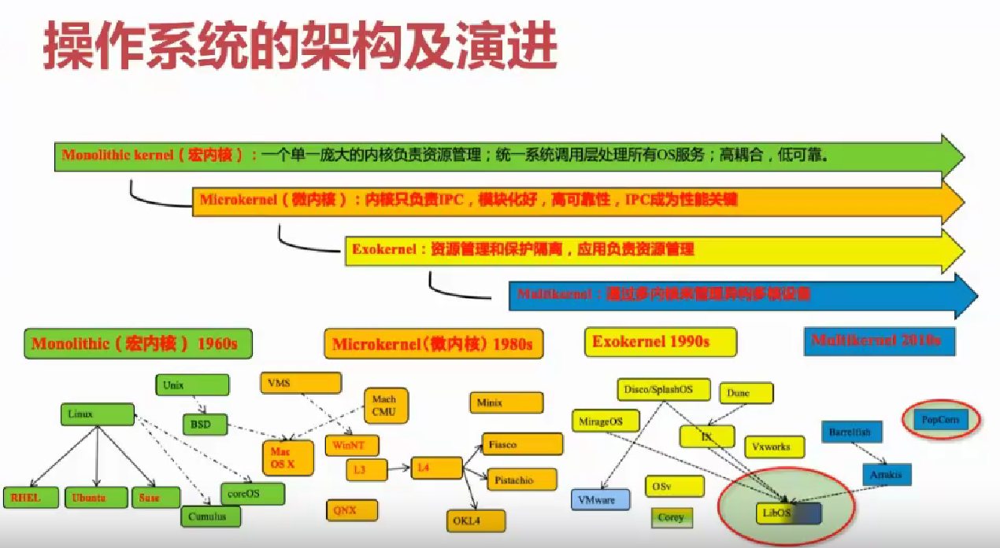
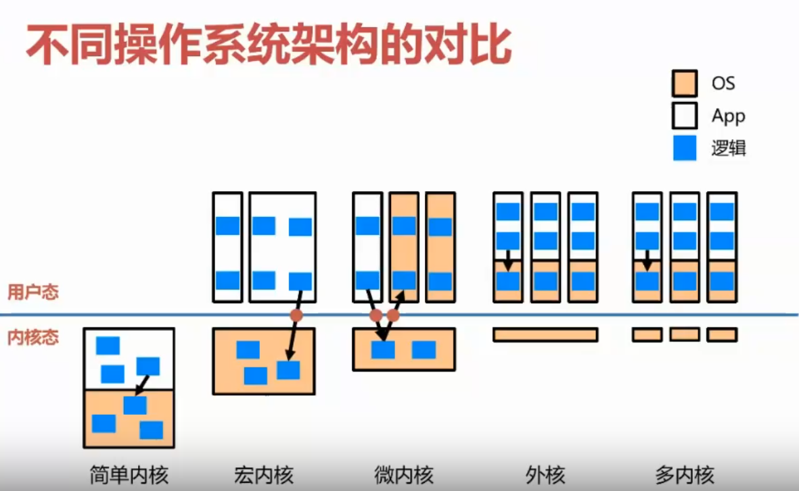

# 结构的重要性

## 本节目录

- [结构的重要性](#结构的重要性)
  - [本节目录](#本节目录)
  - [复杂性](#复杂性)
  - [想办法降低其复杂性](#想办法降低其复杂性)
  - [历史上的架构与其演进](#历史上的架构与其演进)

## 复杂性

1991-1995 年，IBM 公司投入 20 亿美元打造 Workplace 操作系统，然而，由于目标过于宏伟，系统过于复杂等种种原因，导致该项目最终失败，20 亿美元的投资打了水漂。同时，此项目的失败，也间接导致 IBM 全力投入扶植 Linux 操作系统。

上面的这个例子，应该可以让同学们看到，整个操作系统的复杂性有多么可怕。而在深入分析其“复杂性”来源时，我们可以发现：在操作系统内部，不同目标之间往往存在冲突，而在不同需求之间又需要进行权衡。

对于用户来说，操作系统应该方便使用、容易学习、功能齐全、安全流畅；但对于整个系统目标来说，操作系统应该容易设计与实现，容易维护，具有高灵活性、高可靠性和高效性。这就导致操作系统的复杂性居高不下。

## 想办法降低其复杂性

而为了降低其复杂性，计算机科学家们提出：要将策略和机制进行分离，操作系统只能通过调整策略而不是机制来适配解决实际问题。

以调度算法为例，RR、FIFO 等都是策略，但调度队列、对线程的表示等，都是机制。

## 历史上的架构与其演进

接下来，我们会给大家展示架构的发展历史和各种架构的对比。

