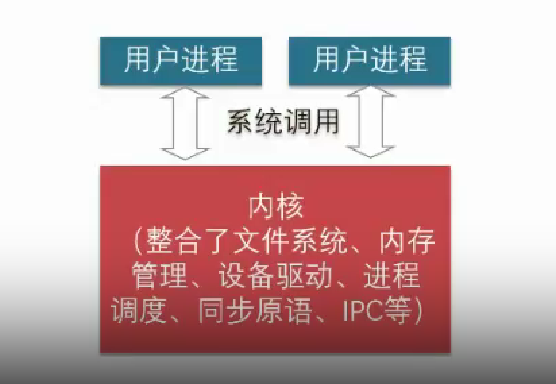
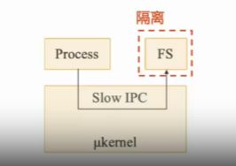
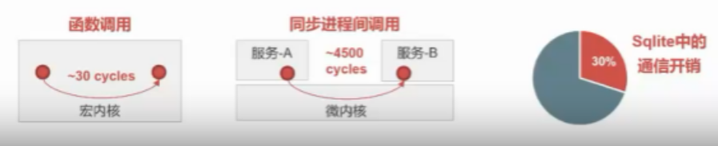
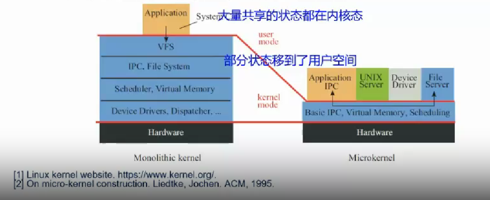
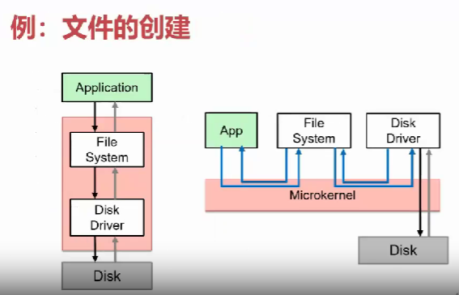
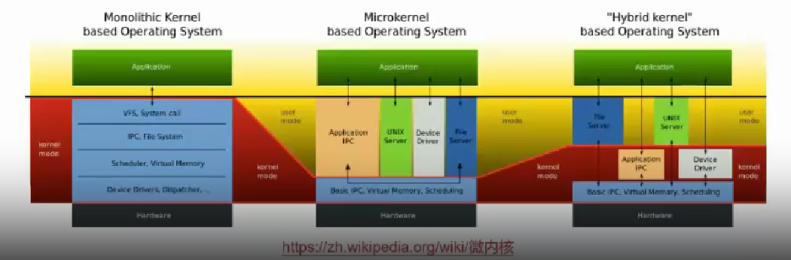

# 宏内核 & 微内核

## 本节目录

- [宏内核 \& 微内核](#宏内核--微内核)
  - [本节目录](#本节目录)
  - [什么是宏内核](#什么是宏内核)
  - [宏内核的优点](#宏内核的优点)
  - [宏内核的缺点](#宏内核的缺点)
  - [什么是微内核](#什么是微内核)
  - [微内核的优点](#微内核的优点)
  - [微内核的缺点](#微内核的缺点)
  - [宏内核 vs 微内核](#宏内核-vs-微内核)
  - [混合内核架构](#混合内核架构)

## 什么是宏内核

在宏内核架构下，整个系统被分为内核与应用两层，内核运行在特权级，集中控制所有计算资源，应用运行在非特权级，受内核管理，使用内核提供的各种服务。更简明的解释如下图所示：

## 宏内核的优点

- **丰富的沉淀和积累**：宏内核经过多年的发展，积累了丰富的功能和优化。
- **巨大的统一的社区和生态**：拥有庞大的用户群体和开发者社区，生态完善。
- **针对不同场景的优化**：经过 30 年的优化，宏内核能够针对各种场景提供高效的支持。

## 宏内核的缺点

- **安全性与可靠性问题**：模块之间缺乏强隔离机制，可能导致安全隐患和可靠性问题。
- **实时性支持**：由于系统复杂，难以进行最坏情况时延分析，不利于实时应用。
- **系统过于庞大**：如 Linux 等宏内核系统代码行数庞大，可能阻碍了创新和灵活性。
- **扩展性**
  - **向上扩展**：难以剪裁和扩展宏内核系统以支持从 KB 级别到 TB 级别的不同场景。
  - **向下扩展**：同样存在扩展性挑战，难以满足极小化系统的需求。
- **硬件异构性**：难以长期支持定制化的方式解决特定硬件问题。
- **功能安全**：例如 Linux，很难通过严格的功能安全认证（如汽车安全完整性认证 ASIL-D）。
- **信息安全**：单点错误可能导致整个系统出错，存在大量已知的安全问题（CVE）。
- **确定性时延**：虽然 Linux 花费了多年时间合并实时补丁，但目前仍不确定是否能支持确定性时延要求。

## 什么是微内核

在微内核架构下，采用“最小化内核功能”的方式，将操作系统功能移到用户态，称为"服务"(Server)，而在用户模块之间，使用消息传递机制通信。下图所示为微内核架构：

## 微内核的优点

- **易于扩展**：直接添加一个用户进程即可为操作系统增加服务。
- **易于移植**：大部分模块与底层硬件无关。
- **更加可靠**：在内核模式运行的代码量大大减少。
- **更加安全**：即使存在漏洞，服务与服务之间存在进程粒度隔离。
- **更加健壮**：单个模块出现问题不会影响到系统整体。

## 微内核的缺点

- **性能较差**：内核中的模块交互由函数调用变成了进程间通信。
- **生态欠缺**：尚未形成像 Linux 一样具有广泛开发者的社区。
- **重用问题**：重用宏内核操作系统提供兼容性，带来新问题。

下面的图可以直观展示出微内核的性能缺陷：

有兴趣研究微内核的同学，可以自行查找相关资料学习。

## 宏内核 vs 微内核

下面，我们对比一下宏内核和微内核。

它们的一个非常大的区别，在于共享数据状态。宏内核中，大量的共享状态在内核态；而微内核里，部分数据在内核态，部分在用户态。

其次，在性能上，我们在上一部分已经展示出，对于某些情况下，微内核的性能会比宏内核差很多。

对于实际的操作流程，以“创建文件”为例：

## 混合内核架构

既然宏内核和微内核各有优缺点，那么有没有一种架构，能够结合两者的优点，同时避免两者的缺点呢？

答案是有的，这就是混合内核架构。

混合内核架构，将需要性能的模块重新放回内核态，所以可以同时具备宏内核和微内核的优点，同时避免两者的缺点。

- Windows NT：微内核+内核态的系统服务+系统框架
- macOS/i0S：Mach 微内核+BSD4.3+系统框架
