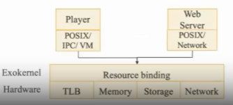
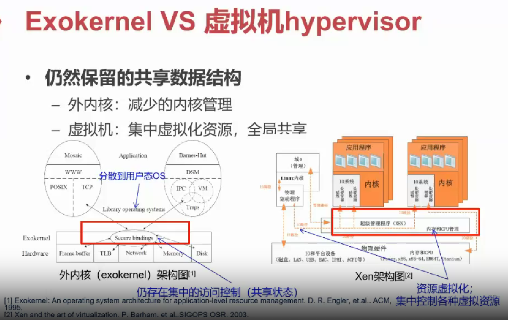

# 外核 + libOS

## 本节目录

- [外核 + libOS](#外核--libos)
  - [本节目录](#本节目录)
  - [什么是外核与 libOS](#什么是外核与-libos)
  - [单内核](#单内核)
  - [外核的优点](#外核的优点)
  - [外核的缺点](#外核的缺点)
  - [外核 VS 虚拟机](#外核-vs-虚拟机)

## 什么是外核与 libOS

外核：

- Exokernel 不提供硬件抽象
  - “只要内核提供抽象，就不能实现性能最大化"
  - 只有应用才知道最适合的抽象(end-to-end 原则)
- Exokernel 不管理资源，只管理应用
  - 负责将计算资源与应用的绑定，以及资源的回收
  - 保证多个应用之间的隔离

库 OS(Libos)：

- 策略与机制分离：将对硬件的抽象以库的形式提供
- 高度定制化：不同应用可使用不同的 LibOS，或完全自定义
- 更高性能：Lib0s 与应用其他代码之间通过函数调用直接交互

对于外核，图示如下：

外核拥有与宏内核和微内核不同的功能，因此也提出了新的技术。

为了追踪计算资源的拥有权，采用了安全绑定(Secure binding)；为了保证资源的保护，采用了显式回收(Visible revocation)；同时，为了能够回收对资源的访问权，额外增加了中止协议(Abort protocol)。建议同学们对这部分内容进行自学。

## 单内核

LibOS 可以进一步拓展为单内核，即一个内核管理多个应用。

单内核可以看做虚拟化环境下的 LibOS，每个虚拟机只使用内核态，在内核态中只运行一个应用和 LibOS，同时，通过虚拟化层实现不同实例间的隔离。

单内核非常适合容器应用场景，因为每个容器就是一个虚拟机，而且每个容器运行定制的 LibOS，可以有效提高性能。

对于单内核的开源项目，我们搜集到以下内容，感兴趣的同学可以进行自学：

- Rumprun：POSIX 接口，BSD 兼容的运行时环境，运行在 Xen 虚拟化平台之上
- Drawbridge：来自微软，兼容 Win32 接口的运行时环境
- OSv：与 Linux 兼容的应用环境，单地址空间

同时，既然涉及到“LibOS”，就可以回到我们上一章提到的问题：操作系统能不能作为一个库？对于这个问题，有人提出了“Linux as a LibOS”，将 Linux 作为 LibOS 或 Unikernel 运行，但引入了很多新问题：

- Linux 是否适合作为 LibOS/unikernel?
- fork()如何处理?

此技术尚在探索阶段，感兴趣的同学可以进行自学。一个类似的例子是：LKL-Linux kernel library(https://github.com/lkl)

## 外核的优点

- OS 无抽象，能在理论上提供最优性能
- 应用对计算有更精确的实时等控制
- LibOS 在用户态更易调试，调试周期更短

## 外核的缺点

- 对计算资源的利用效率主要由应用决定
- 定制化过多，导致维护难度增加

## 外核 VS 虚拟机

以下是对于外核与虚拟机的对比，感兴趣的同学可以搜集相关资料自学。

