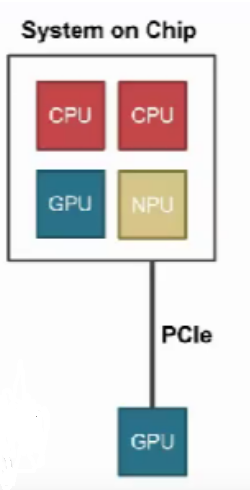
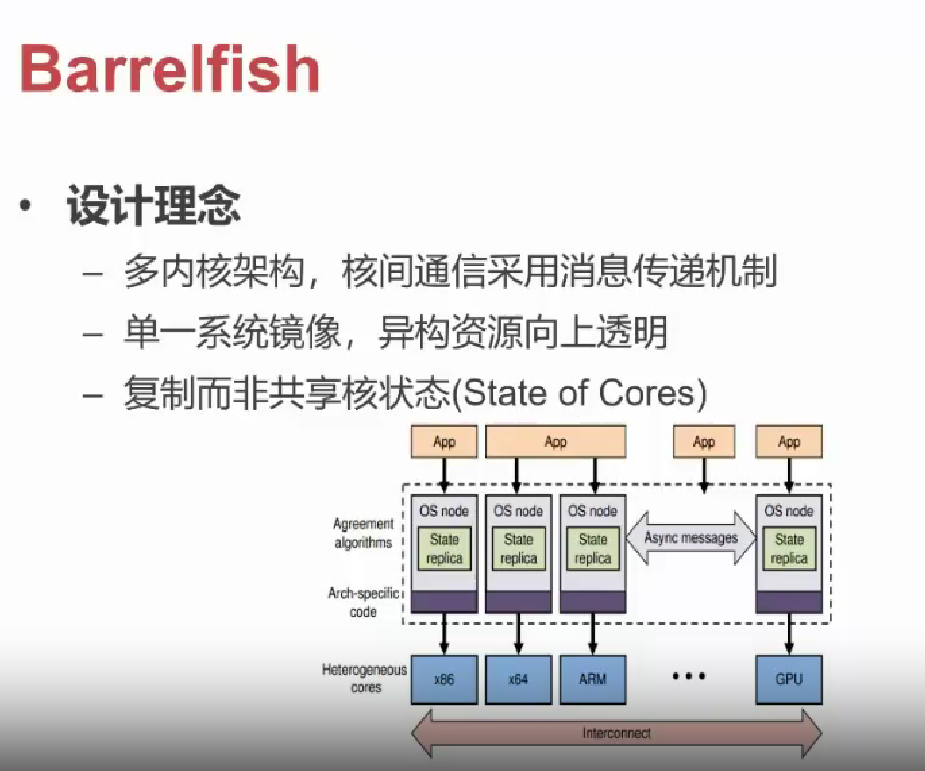

# 多内核 / 复内核

## 本节目录

- [多内核 / 复内核](#多内核--复内核)
  - [本节目录](#本节目录)
  - [使用多内核架构的背景](#使用多内核架构的背景)
  - [使用多内核架构的原因](#使用多内核架构的原因)
  - [使用多内核架构的实例](#使用多内核架构的实例)

## 使用多内核架构的背景

- 现在的 OS 内部维护很多共享状态
  - Cache 一致性的保证越来越难
  - 可扩展性非常差，核数增多，性能不升反降
- GPU 等设备越来越多
  - 设备本身越来越智能--设备有自己的 CPU
  - 通过 PCle 连接，主 CPU 与设备 CPU 之间通信非常慢
  - 通过系统总线连接，异构 SoC(Syslem on Chip)

对于 System on Chip，来说，其图解如下所示：

以上的一系列背景，就使得使用多内核架构逐渐成为更优的解决方案。

## 使用多内核架构的原因

- 可以适配众核硬件平台
- 现有的 OS 架构在多核情况下，存在内核资源争用问题
- 现有的 OS 架构难以应对，应用混合部署下的性能隔离问题
- 现有的 OS 架构在异构硬件环境下资源利用率低

## 使用多内核架构的实例

