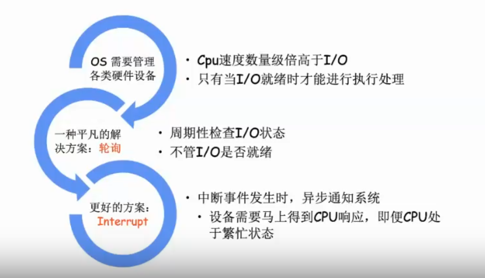
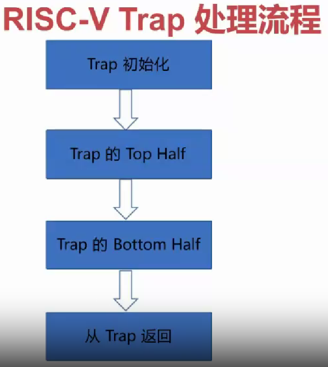
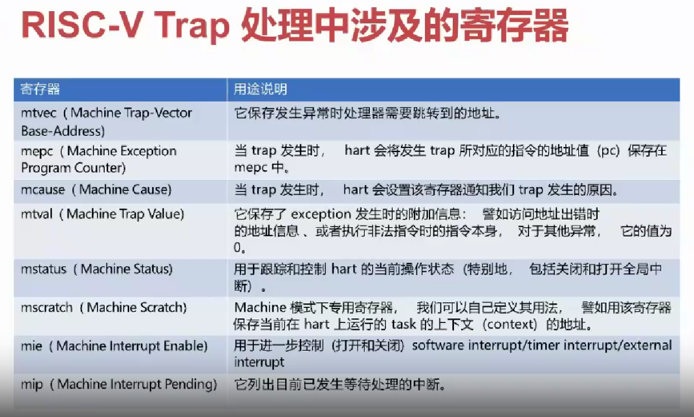
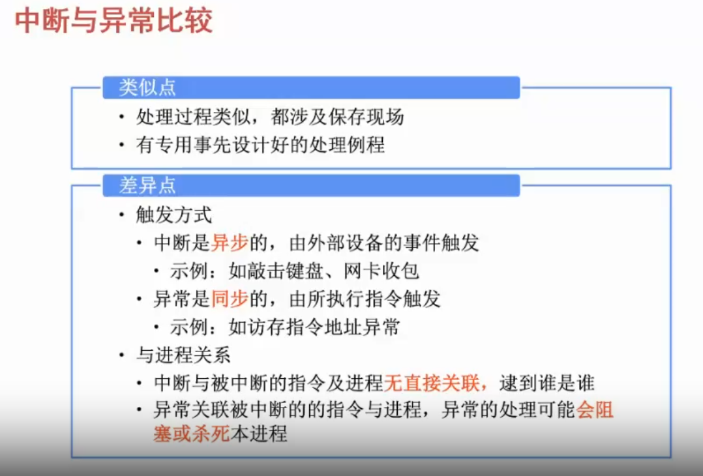

# 中断和异常

## 本节目录

- [中断和异常](#中断和异常)
  - [本节目录](#本节目录)
  - [中断与轮询](#中断与轮询)
  - [中断与异常的定义](#中断与异常的定义)
  - [处理流程](#处理流程)
  - [trap 定义](#trap-定义)
  - [在处理 trap 时使用到的寄存器](#在处理-trap-时使用到的寄存器)
  - [异常处理函数](#异常处理函数)
  - [中断和异常的对比](#中断和异常的对比)

## 中断与轮询

首先，我们假想一下，我们正在设计一个操作系统，现在，我们需要为它提供键盘支持。那么，我们如何实现这个功能？

一种方法是，我们使用轮询的方式，即，我们定期检查键盘的状态，如果键盘有输入，我们就处理它。但是，这种方式有一个问题，就是，如果键盘没有输入，那么，我们就会白白浪费 CPU 资源。那么，有没有更好的方法呢？有的，这就是中断。

中断是一种异步的事件处理机制。当某个事件发生时，操作系统会自动调用相应的处理函数来处理该事件。这样，我们就不用一直轮询键盘的状态了。

从上面这个例子，可以举一反三到更多的场景，如下图所示：

## 中断与异常的定义

中断和异常的通用概念如下：

- 中断(Interrupt) —— 异步异常
  - 外部硬件设备所产生的信号
  - 异步：产生原因和当前执行指令无关，如程序被磁盘读打断
- 异常(Exception) —— 同步异常
  - 软件的程序执行而产生的事件
  - 同步：产生和当前执行或试图执行的指令相关

## 处理流程

CPU 的执行逻辑很简单：

1. 以 PC 的值为地址从内存中获取一条指令并执行
2. PC+=4，goto 1

而在上面的执行过程中，可能发生以下两种情况：

1. 指令执行出现错误，比如除零或缺页(同步异常)
2. 外部设备触发中断(异步异常)

上面的这两种情况，在 RISC-V 平台称为「异常」和「中断」。在检测到上面两种情况时，OS 会进入“trap”。

具体的 trap 处理各阶段的工作，需要同学们根据老师上课教学内容，进行学习。

## trap 定义

- 控制流(Control Flow)：

1. Branch
2. Jump

- 异常控制流(ExceptionalControlFlow，ECF)：

1. exception
2. interrupt

在 Risc-V 下，ECF 统称为 trap。

对于 OS 来说，想要实现 trap，总共分为下面两步：

1. 实现对异常向量表的设置

- CPU 上电后立即执行，这是系统初始化的主要工作之一
- 在开启中断和启动第一个应用之前执行完毕

2. 实现对不同异常(中断)的处理函数

- 处理应用程序出错的情况：如除零、缺页
- 一类特殊的同步异常：系统调用（我们会在下一节详细介绍），由应用程序来主动触发
- 处理来自外部设备的中断：如收取网络包、获取键盘输入等

## 在处理 trap 时使用到的寄存器

相关寄存器的参数内容，请同学们参考 RISC-V 手册等参考资料进行自学。

## 异常处理函数

异常处理函数在核心态，可以访问所有资源。处理器将异常类型存储在指定寄存器中（例如，`cause`），表明发生的是哪一种异常。异常处理函数根据异常类型执行不同逻辑。

当异常处理函数完成异常处理后，可以通过以下操作之一转移控制权：

1. 回到发生异常时正在执行的指令
2. 回到发生异常时的下一条指令
3. 结束当前进程

## 中断和异常的对比

