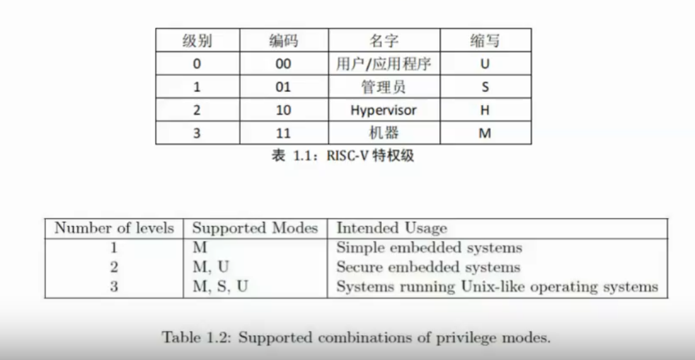

# 系统调用

## 本节目录

- [系统调用](#系统调用)
  - [本节目录](#本节目录)
  - [特权级](#特权级)
  - [跟踪系统调用](#跟踪系统调用)
  - [参数与返回值](#参数与返回值)
  - [提高性能](#提高性能)

## 特权级

系统调用需要特权级机制的支持。在 Risc-V 中，特权级如下表所示：


## 跟踪系统调用

假设有代码：

```c
int main() {
    write(1,"Hello world!\n",13);
    return 0;
}
```

我们可以通过下面命令跟踪系统调用：

```shell
strace -o hello.out ./hello
```

## 参数与返回值

系统调用的参数和返回值都是通过寄存器传递的。

- 最多允许 8 个参数：a0-a7
- a7 用于存放系统调用编号
- 调用者保存的寄存器必须在用户态保存
- 返回值存放于 a0 寄存器中

但是，如果出现，系统调用的传参过多，无法直接使用寄存器放下，该怎么办呢？

朴素的解决方案是，通过将指针写入寄存器，然后由内核去访问指针指向的空间，但这可能会导致一系列的安全问题。因此，就需要验证其是否合法。对于此部分内容，需要同学们跟着老师学习，并且掌握 Linux 解决此问题的方案。

## 提高性能

在对系统调用进行性能分析时，能够发现，主要的开销在于系统调用切换。因此，为了进一步提高性能，系统调用的时延不可忽略，尤其是调用非常频繁的那些，如 `gettimeofday()`。它的大部分时延都是由于 U->S/M 的模式切换带来的，如果没有模式切换，那么就不需要保存回复状态，就能够大幅降低系统调用的时延。

对于其，可以采用如下方式优化：
将 gettimeofday 的代码加载到一块与应用共享的内存页，这个页称为：vDSO(Virtual Dynamic Shared Object)，然后，将 Time 的值同样映射到用户态空间(只读)，但只有在内核态才能更新这个值。

不仅仅是 gettimeofday()，其它大部分的系统调用的大量时延，都是用来做状态的切换（保存和恢复状态、权限的切换）。还有一部分的时延，是因为（Cache pollution）。那么，是否有可能在不切换状态的情况下实现系统调用?

一个可行的解决方案是，引入了一个新的 syscall 机制：

- 引入 system call page，由 user & kernel 共享
- User threads 可以将系统调用的请求 push 到 system call page
- `kernel threads`会从`system call page` poll `system call 请求`

性能提高的剩余内容，需要同学们跟随老师讲解学习。
