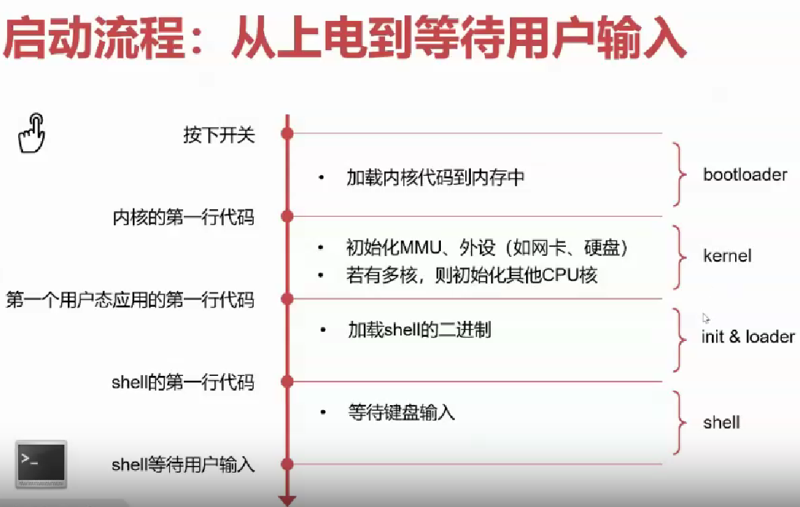

# 计算机的启动

## 本节目录

- [计算机的启动](#计算机的启动)
  - [本节目录](#本节目录)
  - [流程概要](#流程概要)
  - [硬件 - 加电自检](#硬件---加电自检)
  - [软件 - 内核启动](#软件---内核启动)

## 流程概要

在计算机启动的过程中，BIOS 会首先进行加电自检，然后加载操作系统内核。计算机先进行硬件部分的加载，然后进行对于软件部分（即 OS）的加载，然后跳转到内核中执行。

## 硬件 - 加电自检

在这一部分，我们会介绍加电自检。它的基本过程如下：

1. 初始化 BIOS
2. 检查 CPU 寄存器检查 BIOS 代码的完整性
3. 检查 DMA、timer、interrupt controller
4. 检查系统内存
5. 检查系统总线和外部设备
6. 跳转到下一级 BIOS(如 VGA-BIOS)执行并返回
7. 识别可以启动的设备(CD-ROM？USB？HDD？)

但这一部分就涉及到了一个问题：由谁来执行这些检查？这一问题，我们将在下一节回答。

## 软件 - 内核启动

在 BIOS 执行完加电自检之后，它会将控制权交给操作系统内核。此时，操作系统主要会进行两个任务：

- 配置页表并开启虚拟内存机制，允许使用虚拟地址
- 配置异常向量表并打开中断，允许“双循环”

同学们通过听课学习，应该要掌握：

- 页表究竟该如何具体配置?
- 异常向量表如何配置?
- 开启地址翻译的前一行指令使用物理地址，开启后立即使用虚拟地址，前后如何衔接?
- 打开后，异常处理的指令流如何流动?
