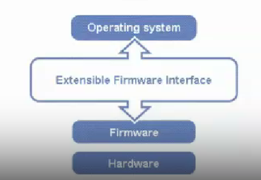
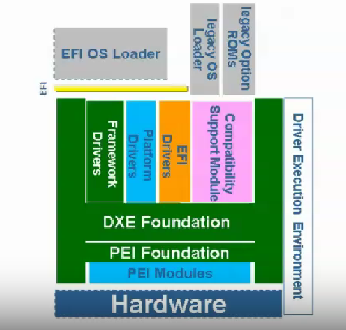
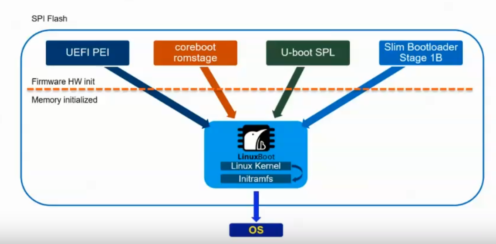

# EFI / UEFI

## 本节目录

- [EFI / UEFI](#efi--uefi)
  - [本节目录](#本节目录)
  - [EFI / UEFI 简介](#efi--uefi-简介)
  - [EFI / UEFI 与 BIOS 的区别](#efi--uefi-与-bios-的区别)
  - [EFI / UEFI 的结构](#efi--uefi-的结构)
  - [EFI / UEFI 当前进展](#efi--uefi-当前进展)

## EFI / UEFI 简介

在上一节提到，BIOS 主要流行于 1970s 到 1990s，因为计算机硬件设备种类繁多，而 BIOS 只能识别硬件设备，无法识别软件设备，而不再能满足计算机硬件设备日益复杂的需求。因此，1990s 后，出现了 EFI / UEFI。

Intel 提出了，使用 EFI(Extensible Firmware Interface)取代 BlOS interface 。

2005 年，Intel 再次提出用 UEFI(Unified Extensible Firmware Interface)取代 EFI。

下图展示了 EFI 的架构位置：

## EFI / UEFI 与 BIOS 的区别

首先，对于编程语言来说，BIOS 主要使用汇编语言，而 EFI 主要使用 C 语言。EFI 是用模块化的思想，借助动态链接的形式构建的系统，较 BIOS 而言更易于实现，容错和纠错特性更强，缩短了研发时间。

其次，对于 BIOS 具有的三大任务：

1. 初始化硬件
2. 提供硬件的软件抽象
3. 启动操作系统

UEFI 具有三大优势：

1. 标准接口
2. 开放统一
3. 开源

同时，EFI 运行于 32 位或 64 位模式，突破了传统 16 位代码的寻址能力。而 BIOS 的硬件服务程序都以 16 位代码的形式存在，这就给运行于增强模式的操作系统访问其服务造成了困难。

而且，EFI 系统下的驱动并不是由可以直接运行在 CPU 上的代码组成的，而是用 EFIByte Code 编写而成的。这是一组专用于 EFI 驱动的虚拟机器语言，必须在 EFI 驱动运行环境下被解释运行。这就保证了充分的向下兼容性。

因此，EFI 和 UEFI 才能够被广泛接受。

## EFI / UEFI 的结构

更加具体的 EFI 的架构位置如下图所示：

## EFI / UEFI 当前进展

当前，对于 UEFI 应用的一个典型例子是 LinuxBoot：

感兴趣的同学们可以参考：

- [LinuxBoot](https://www.kernel.org/doc/html/v6.9-rc7/arch/loongarch/booting.html)
