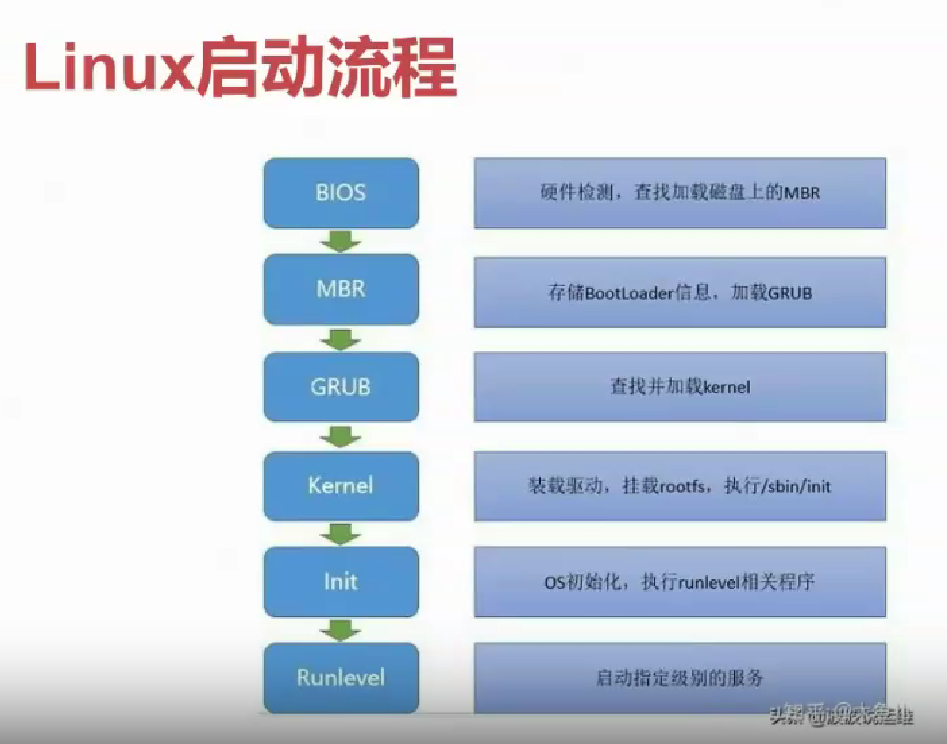

# Grub、Init 与 RunLevel

## 本章目录

- Grub 简介
- Init 简介
- RunLevel 简介
- 目前进展（init->systemd）

## Linux 启动流程

在 Linux 系统下，启动流程如下：

## 引导程序 - bootloader

bootloader，即引导程序，是开机时，引导操作系统启动的程序。

BIOS 在完成硬件检测和资源分配后，将硬盘 MBR 中的 bootloader 读到系统的 RAM 中，然后将控制权交给 bootloader。

bootoader 的主要任务就是将操作系统内核从硬盘加载到 RAM 中，然后跳转到内核的入口点去执行，即启动操作系统。

常见的 bootloader 有：Grub，isolinux，uboot，openSBl，ntldr(用于启动 Windows 系统)，**Linuxboot**等。

操作系统需要被加载到内存中正确的位置，且需要程序为操作系统提供启动参数，以实现定制化启动，所以需要 bootloader。

## Grub 简介

Grub 是 Linux 上最常用的 bootloader。它是一个来自 GNU 项目的启动引导程序。GRUB 允许用户可以在计算机内同时拥有多个操作系统，并在计算机启动时选择希望运行的操作系统，也就是说，我们可以通过 Grub，使用链式引导来引导 Windows 系统。

它支持所有的 Linux 文件系统，也支持 Windows 的 FAT 和 NTFS 文件系统，也支持图形界面，可定制启动菜单和背景图片，支持鼠标。同时，它拥有丰富的终端命令，用户可以查看硬盘分区的细节，修改分区设置，临时重新映射磁盘顺序，从任何用户定义的配置文件启动。

感兴趣的同学们可以去自行深入了解 Grub。

## Init 简介

初始化（Init）程序负责操作系统的初始化操作，它基于`/etc/inittab`（定义了系统默认运行级别）设定的动作来执行脚本。以下是初始化流程的主要步骤：

1. **执行`/etc/rc.d/rc.sysinit`脚本**

   - 真正的 OS 初始化脚本。

2. **激活 udev 和 SELinux**

   - udev 管理设备节点和它们的符号链接。
   - SELinux（如果启用）是 Linux 的一个安全模块。

3. **设定内核参数**

   - 根据`/etc/sysctl.conf`文件来设定内核参数。

4. **设定系统时钟**

   - 确保系统时间正确。

5. **装载硬盘映射**

   - 加载硬盘相关的映射或配置。

6. **启用交换分区**

   - 激活交换空间以扩展系统内存。

7. **设置主机名**

   - 设置系统在网络中的名称。

8. **根文件系统检测与重新挂载**

   - 以读写方式重新挂载根文件系统，并在挂载前进行检测。

9. **激活 RAID 和 LVM 设备**

   - 如果配置有 RAID 或 LVM，则激活这些设备。

10. **启用磁盘配额**

    - 根据配置，启用文件系统上的磁盘配额。

11. **检查并挂载其他文件系统**

    - 根据`/etc/fstab`文件，检查并挂载其他文件系统。

12. **清理过期的锁和 PID 文件**

    - 清除在系统启动过程中可能不再需要的锁文件和 PID 文件。

13. **执行对应启动级别的脚本**

    - 根据配置的启动级别，执行对应目录（如`/etc/rcX.d/`，其中`X`是运行级别）下的脚本。

14. **执行`/etc/rc.d/rc.local`脚本**
    - 这是系统初始化过程中的最后一个通用脚本，用户可以在这里添加自定义的启动命令。

**系统启动完成**

- 执行完以上步骤后，系统启动完成，等待用户登录或其他进一步的操作。

## RunLevel 简介

runlevel，即运行级别，是 Linux 系统中的一个概念。
Linux 的启动级别定义了系统启动时应该运行哪些服务。

运行级别有如下的分类：

- **0**: 关机模式
- **1**: 单一用户模式（直接以管理员身份进入）
- **2**: 多用户模式（无网络）
- **3**: 多用户模式（命令行）
- **4**: 保留（通常不使用）
- **5**: 多用户模式（图形界面）
- **6**: 重启

运行级别对应的脚本目录如下所示：

- **Run level 0**: `/etc/rc.d/rc0.d/`
- **Run level 1**: `/etc/rc.d/rc1.d/`
- **Run level 2**: `/etc/rc.d/rc2.d/`
- **Run level 3**: `/etc/rc.d/rc3.d/`
- **Run level 4**: `/etc/rc.d/rc4.d/`
- **Run level 5**: `/etc/rc.d/rc5.d/`
- **Run level 6**: `/etc/rc.d/rc6.d/`

在上述目录中，脚本的命名遵循以下规则：

- **K** 开头的文件：表示在启动时需要关闭的服务。
- **S** 开头的文件：表示在启动时需要启动的服务。

## 目前进展（init->systemd）

对于 Init 阶段来说，它具有一些问题：

- 启动时间长。ini 进程是串行启动，只有前一个进程启动完才会启动下一个进程。
- 启动脚本复杂。脚本需要自己处理各种情况，这往往使得脚本变得很长。

为了解决上述问题，Linux 系统引入了 Systemd 系统。感兴趣的同学们可以自行了解。
